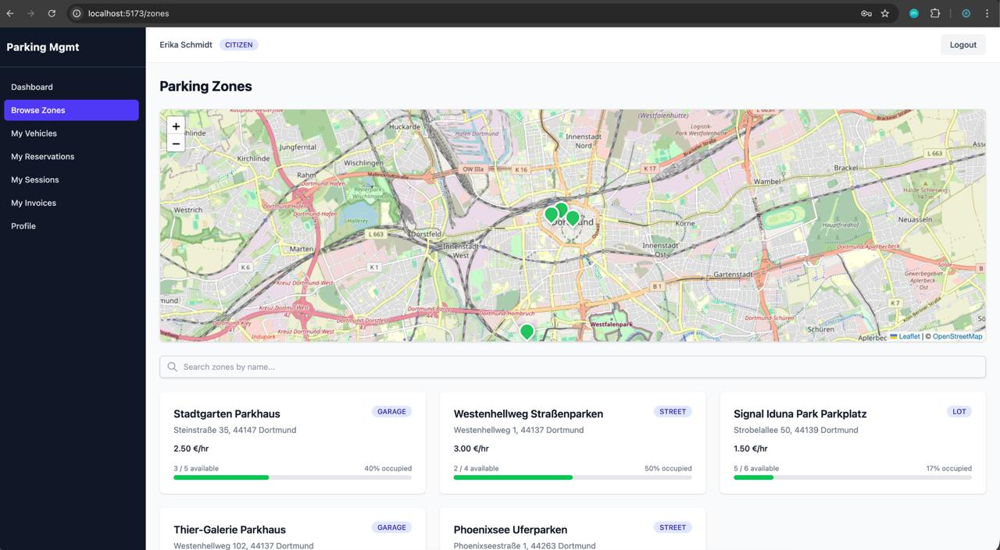
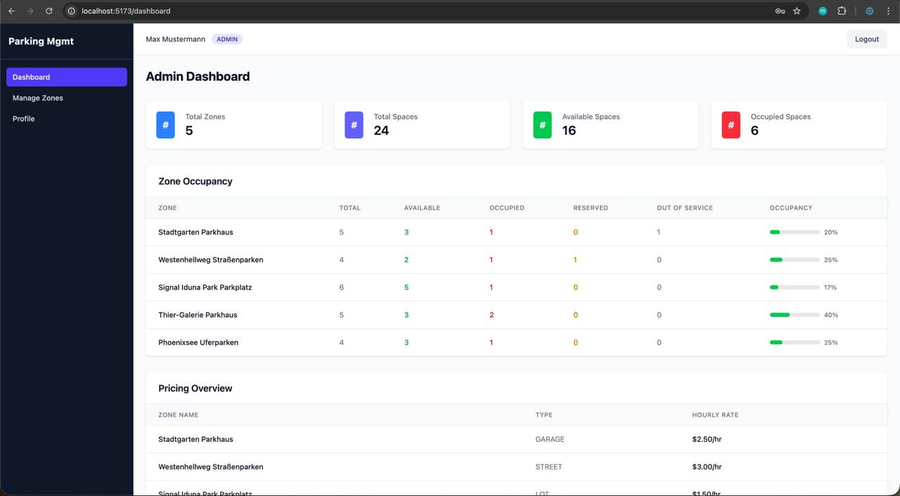
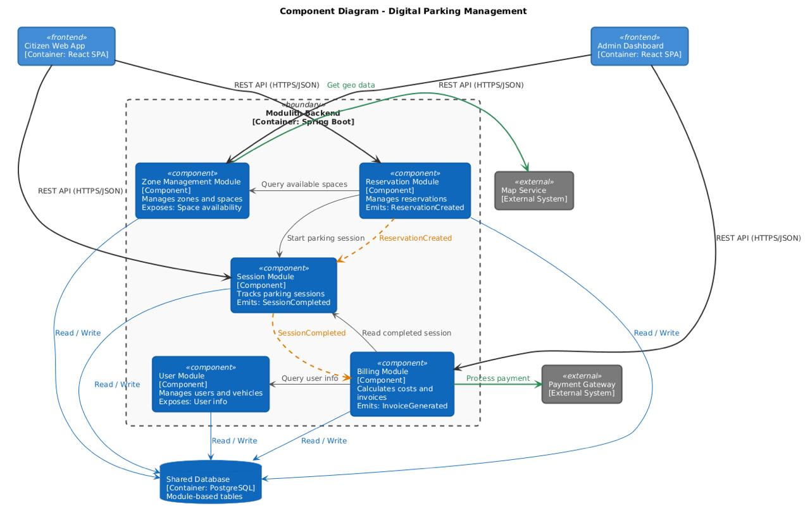

# Digital Parking Management System

A full-stack application for managing parking zones, reservations, sessions, and billing — built with a **Spring Modulith** (modular monolith) backend and a React frontend.

## Screenshots

### Citizen — Browse Zones (with interactive map)



### Admin — Dashboard (occupancy stats & pricing overview)



## Architecture

The backend follows the **Modulith** pattern using [Spring Modulith](https://spring.io/projects/spring-modulith) — a single deployable Spring Boot application with strictly enforced module boundaries. Each module owns its domain, exposes a public API, and communicates with other modules via direct calls (synchronous) or domain events (asynchronous).



### Module Boundaries

Each module declares its allowed dependencies via `@ApplicationModule`. Spring Modulith enforces these at compile time — a module cannot access another module's internals.

| Module | Depends On | Communicates Via |
|--------|-----------|-----------------|
| **Zone** | — (leaf) | Direct calls (public service) |
| **User** | — (leaf) | Direct calls (public service) |
| **Auth** | User | Direct calls |
| **Reservation** | Zone, User | Sync calls + publishes `ReservationCreated` event |
| **Session** | Zone, User, Reservation | Sync calls + publishes `SessionCompleted` event |
| **Billing** | Session only | Consumes `SessionCompleted` event (async) |

### Key Modulith Patterns Used

- **`@ApplicationModule(allowedDependencies)`** — enforces which modules can depend on which
- **`@Modulithic(sharedModules)`** — marks shared utilities available to all modules
- **`ApplicationEventPublisher`** — publishes domain events within the modulith
- **`@ApplicationModuleListener`** — listens for events from other modules (e.g., billing listens to session)
- **`spring-modulith-starter-jpa`** — durable event publication via `event_publication` table (at-least-once delivery)

## Tech Stack

### Backend

| Technology | Version | Purpose |
|-----------|---------|---------|
| Java | 17 | Language runtime |
| Spring Boot | 4.0.4 | Application framework |
| Spring Modulith | 2.0.0 | Modular monolith architecture & event system |
| Spring Security | 7.x | Authentication & authorization |
| Spring Data JPA | 4.x | ORM & repository abstraction |
| Hibernate | 7.x | JPA implementation |
| JJWT | 0.12.6 | JWT token creation & validation |
| Flyway | latest | Database schema migrations & seed data |
| PostgreSQL | 17 | Relational database |
| Maven | 3.9.x | Build tool (via Maven Wrapper) |

### Frontend

| Technology | Version | Purpose |
|-----------|---------|---------|
| React | 19.2 | UI library |
| TypeScript | 5.9 | Type-safe JavaScript |
| Vite | 8.0 | Build tool & dev server |
| Tailwind CSS | 4.2 | Utility-first CSS framework |
| React Router | 7.13 | Client-side routing & route guards |
| Axios | 1.13 | HTTP client with JWT interceptor |
| Leaflet | 1.9 | Interactive maps (OpenStreetMap, no API key) |
| React Leaflet | 5.0 | React bindings for Leaflet |

### Infrastructure

| Technology | Purpose |
|-----------|---------|
| Docker Compose | PostgreSQL container orchestration |
| Vite Proxy | Frontend `/api` requests proxied to backend (no CORS in dev) |

## Project Structure

```
digital-parking-management/
├── backend/                         Spring Boot modulith backend
│   ├── src/main/java/.../
│   │   ├── auth/                    JWT authentication & Spring Security
│   │   ├── billing/                 Invoices, payments, payment gateway
│   │   ├── reservation/             Parking reservations & domain events
│   │   ├── session/                 Parking sessions & SessionCompleted event
│   │   ├── shared/                  Global error handling, constants
│   │   ├── user/                    Users, vehicles, profile
│   │   └── zone/                    Zones, spaces, occupancy (sole authority on space status)
│   ├── src/main/resources/
│   │   ├── application.yaml         App config (DB, JWT, Flyway)
│   │   └── db/migration/            Flyway SQL migrations (V1–V3)
│   ├── postman/                     Postman collection for API testing
│   ├── pom.xml
│   └── mvnw
├── frontend/                        React SPA
│   └── src/
│       ├── api/                     Axios API client + modules per domain
│       ├── context/                 Auth context (JWT, login, logout)
│       ├── components/
│       │   ├── layout/              AppLayout, Sidebar, TopBar
│       │   ├── guards/              ProtectedRoute, AdminRoute
│       │   └── ui/                  StatusBadge, LoadingSpinner, EmptyState
│       ├── pages/
│       │   ├── auth/                Login page
│       │   ├── citizen/             Dashboard, zones, reservations, sessions, invoices, vehicles
│       │   ├── admin/               Admin dashboard, zone CRUD, space management
│       │   └── ProfilePage.tsx      User profile (view & edit)
│       └── types/                   TypeScript interfaces matching backend DTOs
├── docker-compose.yml               PostgreSQL container
└── README.md
```

## Quick Start

### Prerequisites

- Docker (for PostgreSQL)
- Java 17+
- Node.js 18+

### 1. Start PostgreSQL

```bash
docker compose up -d
```

### 2. Start Backend

```bash
cd backend
./mvnw spring-boot:run
```

Backend runs on http://localhost:8080. Flyway auto-creates all tables and seeds demo data on first run.

### 3. Start Frontend

```bash
cd frontend
npm install
npm run dev
```

Frontend runs on http://localhost:5173 with API proxy to backend.

## Demo Credentials

| Role    | Email                  | Password    |
|---------|------------------------|-------------|
| Admin   | admin@parking.local    | admin123    |
| Citizen | citizen@parking.local  | citizen123  |

## Features

### Citizen

- **Dashboard** — summary cards (active sessions, reservations, pending invoices, available zones)
- **Browse Zones** — interactive Leaflet map + zone cards with occupancy bars
- **Zone Detail** — view spaces, reserve a space, or start a walk-in session
- **My Vehicles** — add / remove vehicles
- **My Reservations** — view active reservations, cancel
- **My Sessions** — view active / completed sessions, stop active ones
- **My Invoices** — view invoices, pay pending ones (Credit Card, Debit Card, Wallet)
- **Profile** — view and edit personal information

### Admin

- **Admin Dashboard** — total zones, spaces, occupancy stats per zone, pricing overview
- **Zone Management** — create, edit, delete parking zones
- **Space Management** — add spaces to zones, change space status
- **Profile** — view and edit personal information

## API Endpoints

### Auth
| Method | Endpoint | Access |
|--------|----------|--------|
| POST | `/api/auth/login` | Public |
| POST | `/api/auth/register` | Public |
| GET | `/api/auth/me` | Authenticated |

### Zones
| Method | Endpoint | Access |
|--------|----------|--------|
| GET | `/api/zones` | Public |
| GET | `/api/zones/{id}` | Public |
| GET | `/api/zones/{id}/occupancy` | Public |
| GET | `/api/zones/{id}/spaces` | Public |
| GET | `/api/zones/{id}/spaces/available` | Public |
| POST | `/api/zones` | Admin |
| PUT | `/api/zones/{id}` | Admin |
| POST | `/api/zones/{id}/spaces` | Admin |
| PATCH | `/api/zones/{id}/spaces/{spaceId}/status` | Admin |

### Users & Vehicles
| Method | Endpoint | Access |
|--------|----------|--------|
| GET | `/api/users/{id}` | Authenticated |
| PUT | `/api/users/{id}` | Authenticated |
| GET | `/api/users/{id}/vehicles` | Authenticated |
| POST | `/api/users/{id}/vehicles` | Authenticated |
| DELETE | `/api/users/{id}/vehicles/{vehicleId}` | Authenticated |

### Reservations
| Method | Endpoint | Access |
|--------|----------|--------|
| POST | `/api/reservations` | Authenticated |
| GET | `/api/reservations?userId={id}` | Authenticated |
| GET | `/api/reservations/{id}` | Authenticated |
| POST | `/api/reservations/{id}/cancel` | Authenticated |

### Sessions
| Method | Endpoint | Access |
|--------|----------|--------|
| POST | `/api/sessions/start` | Authenticated |
| POST | `/api/sessions/{id}/stop` | Authenticated |
| GET | `/api/sessions/{id}` | Authenticated |
| GET | `/api/sessions?userId={id}&status=` | Authenticated |

### Billing
| Method | Endpoint | Access |
|--------|----------|--------|
| GET | `/api/billing/invoices?userId={id}` | Authenticated |
| GET | `/api/billing/invoices/{id}` | Authenticated |
| POST | `/api/billing/invoices/{id}/pay` | Authenticated |
| GET | `/api/billing/payments/{id}` | Authenticated |

## Seeded Demo Data

| Entity | Details |
|--------|---------|
| Users | 2 (admin + citizen with BCrypt passwords) |
| Vehicles | 3 (VW Golf, BMW 3 Series, Audi A4) |
| Zones | 5 locations (Stadtgarten, Westenhellweg, Signal Iduna Park, Thier-Galerie, Phoenixsee) |
| Spaces | 24 total (mix of AVAILABLE, OCCUPIED, RESERVED, OUT_OF_SERVICE) |
| Reservations | 1 active (citizen, Westenhellweg) |
| Sessions | 1 completed + 1 active |
| Invoices | 1 pending (5.00 EUR, Stadtgarten Parkhaus) |

## Domain Events

The modulith uses Spring's event system for inter-module communication where eventual consistency is acceptable:

- **`SessionCompleted`** — published by Session module when parking ends. Carries a pricing snapshot (hourlyRate, zoneName, duration). Consumed by Billing module to auto-generate an invoice. Stored durably in `event_publication` table for at-least-once delivery.
- **`ReservationCreated`** / **`ReservationCancelled`** — published by Reservation module. Available for future consumers.

This decouples Billing from Zone — billing never reads zone data directly. All pricing info arrives via the event snapshot.
